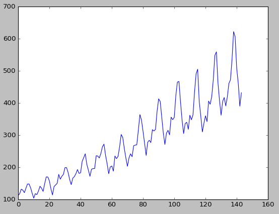
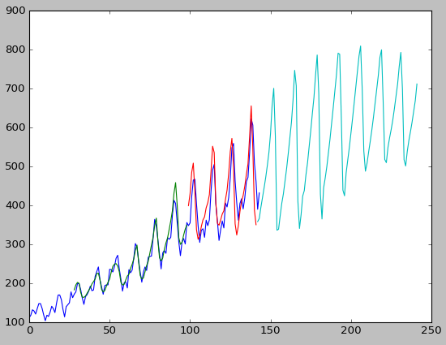

# Time series predictions with Keras

#### Requirements
* Theano
* Keras
* matplotlib
* pandas
* scikit-learn
* tqdm
* numpy


#### Usage
```
git clone https://github.com/gcarq/keras-timeseries-prediction.git
cd keras-timeseries-prediction/
pip install -r requirements.txt
python main.py
```

#### Dataset

The dataset is `international-airline-passengers.csv` which contains 144 data points ranging from Jan 1949 to Dec 1960.
Each data point represents monthly passengers in thousands.



#### Model


```
model = Sequential()
model.add(LSTM(64,
               activation='relu',
               batch_input_shape=(batch_size, look_back, 1),
               stateful=True,
               return_sequences=False))
model.add(Dense(1, activation='linear'))
model.compile(loss='mean_squared_error', optimizer='adam')
```

#### Results

